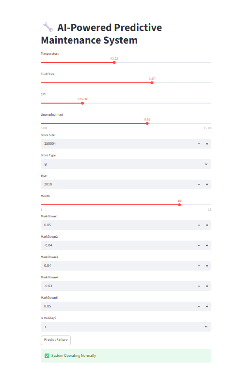
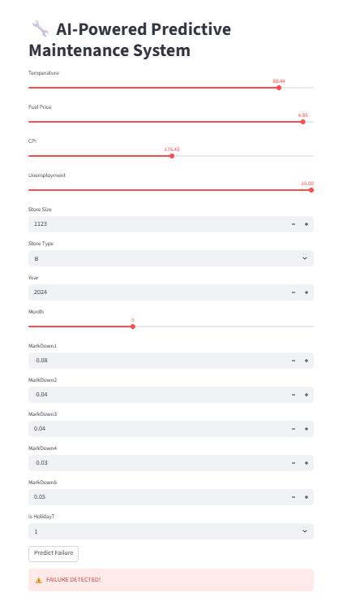
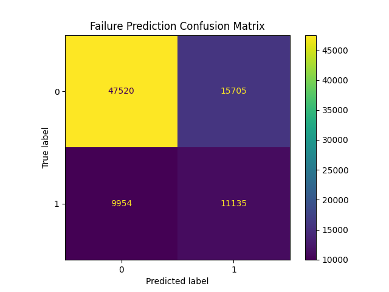
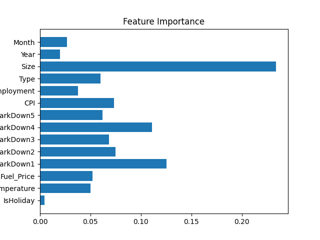

# 🔧 AI-Powered Predictive Maintenance System

🚀 **End-to-end machine learning system that predicts potential failures using operational data and provides real-time alerts via an interactive dashboard.**

---

## ⚡ Key Highlights

* 🔍 Detects potential system failures using ML
* ⚠️ Real-time alert system (Failure / Normal prediction)
* 📊 Handles real-world issues like data leakage & class imbalance
* 🖥️ Deployed with an interactive Streamlit dashboard
* 📈 Achieves ~70% accuracy with improved failure detection

---

## 📌 Overview

This project simulates an AI-based predictive maintenance system used in industries to prevent unexpected failures.

It includes:

* Data preprocessing
* Feature engineering
* Machine learning model (Random Forest)
* Real-time prediction dashboard

---

## 🎯 Problem Statement

Unexpected failures in industrial systems lead to:

* Downtime
* Financial loss
* Reduced efficiency

This system predicts failures in advance using data-driven techniques.

---

## 🏭 Industry Relevance

* Manufacturing plants
* Automotive systems
* IoT-based monitoring
* Energy & power systems

---

## ⚙️ Tech Stack

* Python
* Pandas, NumPy
* Scikit-learn
* Matplotlib
* Streamlit

---

## 📊 Dataset

* Walmart dataset used to simulate operational conditions
* Failure defined using **proxy-based labeling (low performance)**

---

## 🧠 Model Details

* Algorithm: Random Forest Classifier
* Improvements:

  * Removed data leakage
  * Handled class imbalance using weighting

### 📈 Performance

* Accuracy: ~70%
* Improved recall for failure detection

---

## 🏗️ System Architecture

```
Data → Preprocessing → Feature Engineering → Model → Prediction → Dashboard
```

---

### ✅ Normal Operation



### ⚠️ Failure Detection



---

## 📊 Model Insights

### Confusion Matrix



### Feature Importance



---

## 🚀 How to Run

```bash
git clone <your-repo-link>
cd AI-Predictive-Maintenance-System
pip install -r requirements.txt
python main.py
streamlit run app.py
```

---

## 💡 Key Learnings

* Handling real-world data challenges
* Avoiding data leakage
* Managing imbalanced datasets
* Building end-to-end ML systems
* Deploying ML models using Streamlit

---

## 📌 Future Improvements

* Real IoT sensor integration
* Deep learning models (LSTM)
* Real-time streaming pipelines
* Cloud deployment

---

## 👨‍💻 Author

**Varda Kunde**
